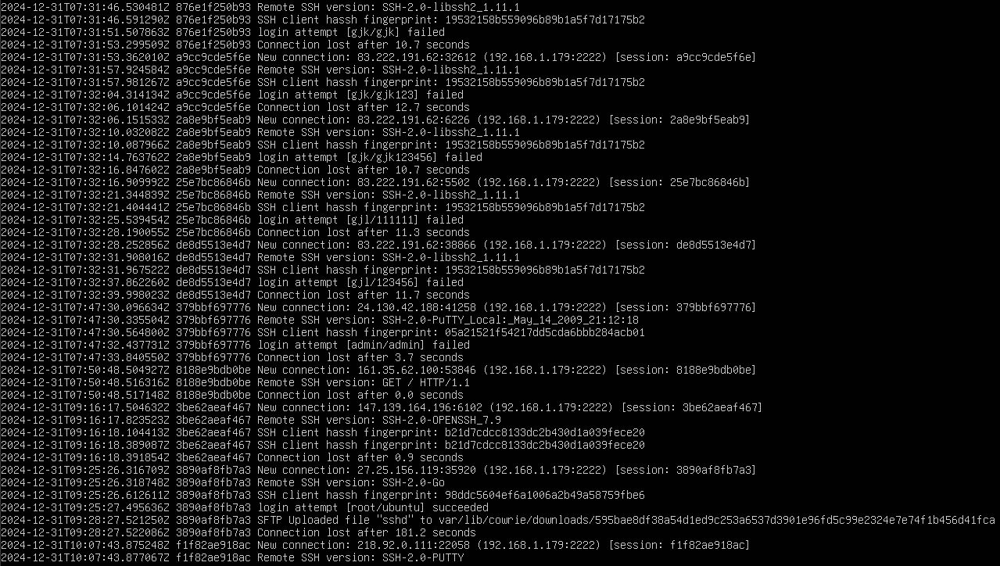
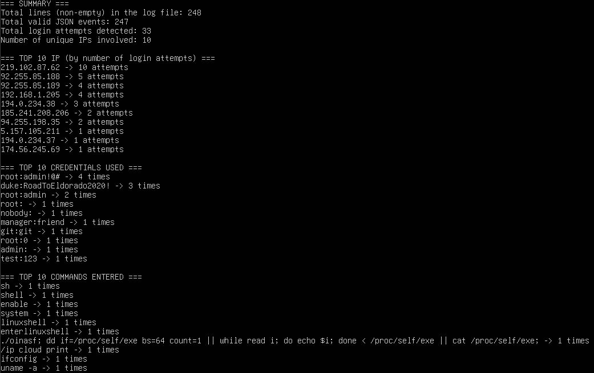

# Cowrie Honeypot Project

## Overview
This project sets up a **Cowrie** honeypot on an Ubuntu Server virtual machine to capture SSH brute-force attempts, gather credentials that attackers try, and log any commands they run. 
Over several days, the honeypot recorded real-world scans and attacks from bots on the internet. 
An accompanying Python script analyzes the resulting logs to identify the most frequent IP addresses, usernames/passwords, and commands used by intruders.
It's useful to learn about log analysis, port forwarding, and Python scripting to derive meaningful insights from honeypot data.

DISCLAIMER: Running a public-facing honeypot can pose security risks. Please ensure the environment is isolated and without sensitive data.

## Table of Contents
1. [Environment Setup](#environment-setup)  
2. [Installing Cowrie](#installing-cowrie)  
3. [Port Forwarding & Firewall](#port-forwarding--firewall)  
4. [Running Cowrie](#running-cowrie)  
5. [Data Collection](#data-collection)  
6. [Log Analysis (Python Script)](#log-analysis-python-script)  
7. [Screenshots](#screenshots)  
8. [License](#license)  
9. [Author](#author)

---

## Environment Setup
- **Host Machine**: A standard desktop running VirtualBox (or VMware).
  
- **Guest OS**: Ubuntu Server 22.04 LTS (64-bit) configured with:
  - 1–2 GB of RAM
  - Bridged network adapter (to obtain a local IP address, e.g., `192.168.1.xxx`)
    
- **Software**:
  - Python 3
  - Git
  - Basic build tools and libraries (`python3-venv`, `python3-dev`, `libssl-dev`, etc.)

I assigned a **static or reserved IP** (e.g., `192.168.1.179`) to avoid changes on reboot.

---

## Installing Cowrie
1. **Update the system**:

   ```bash
   sudo apt update && sudo apt upgrade -y
   ```
3. **Install required packages**:
   ```bash
   sudo apt-get install -y git python3-venv python3-dev libssl-dev libffi-dev build-essential
4. **Clone the Cowrie repository**:
   ```bash
   cd /home/<your-username>/
   git clone https://github.com/cowrie/cowrie.git
   cd cowrie
   ```
5. **Create and activate a Python virtual environment**:
   ```bash
   python3 -m venv cowrie-env
   source cowrie-env/bin/activate
   pip install --upgrade pip setuptools
   ```
6. **Install Cowrie dependencies**:
   ```bash
   pip install -r requirements.txt
   ```
7. **Copy default configuration and (optionally) edit**:
   ```bash
   cp etc/cowrie.cfg.dist etc/cowrie.cfg
   nano etc/cowrie.cfg
   ```

By default, Cowrie listens on port 2222 for SSH. You can redirect port 22 → 2222 via iptables or set up the router to forward port 22 to your VM’s 2222.

---

## Port Forwarding & Firewall
1. **Router Configuration**:
Logged into the router’s admin panel, added a port forwarding rule:
- WAN Port: 22
- LAN IP: 192.168.1.179 (my VM’s IP)
- LAN Port: 22 (or 2222, depending on Cowrie’s config)
Made sure the router firewall allows inbound connections on port 22.

2. **Ubuntu Firewall / iptables**:
A simple example to redirect port 22 → 2222:
```bash
sudo iptables -t nat -A PREROUTING -p tcp --dport 22 -j REDIRECT --to-port 2222
```
To make rules persistent:
```bash
sudo apt-get install netfilter-persistent
sudo netfilter-persistent save
```

3. **Lowering the Modem Firewall**

Some ISP routers label firewall levels as "High/Medium/Low". Setting it to "Low" (or an equivalent "Allow" state) helped in this scenario, to let inbound port 22 pass through.
Also, I verified that the port was open using a service named canyouseeme.org. It showed “Success”, confirming that external SSH traffic could reach the honeypot.

## Running Cowrie
1. **Activate the virtual environment and start Cowrie**:
```bash
cd /home/<your-username>/cowrie
source cowrie-env/bin/activate
bin/cowrie start
```
2. **Logs are generated under the log/ directory**:
- `cowrie.log` (text based)
- `cowrie.json` (JSON-formatted events)
3. **Testing**:
- From another machine (or a phone on mobile data), you can run:
```bash
ssh root@<your-public-IP> -p 22
```
4. **(Optional) Other commands**:
- Stop Cowrie:
```bash
cd /home/<your-username>/cowrie
source cowrie-env/bin/activate
bin/cowrie stop
```
- Check Cowrie status:
```bash
ps aux | grep cowrie
```

---

## Data Collection
Over a 3-day period, the VM was left online, collecting real attacks and commands
from bots scanning the internet.
The size and frequency of attacks can vary. In some cases, you'll see dozens of attempts per day;
other times, you may get fewer.

---

## Log Analysis (Python Script)
A Python script, analyze_cowrie.py, was written to parse the cowrie.json file. It extracts:
- Top IP addresses (by number of login attempts)
- Top credentials (username/password combos)
- Commands that attackers tried to run

Below is an excerpt from my `analyze_cowrie.py` script, which parses the `cowrie.json` file and summarizes login attempts, credentials, and commands. 
For the complete code, see [analyze_cowrie.py](./analyze_cowrie.py).
```python
# analyze_cowrie.py (excerpt)

def main():
    # Dictionaries for stats
    ip_count = {}
    credentials_count = {}
    commands_count = {}

    # Additional counters
    total_lines = 0
    total_events = 0
    login_attempts = 0

    # (Some lines omitted for brevity)
    
    print("=== SUMMARY ===")
    print(f"Total lines in the log file: {total_lines}")
    print(f"Total valid JSON events: {total_events}")
    print(f"Total login attempts: {login_attempts}")
    print(f"Number of unique IPs: {len(ip_count)}")

    # ... remainder of the script is in 'analyze_cowrie.py'

```
To run it:
```bash 
cd /home/<your-username>/cowrie/tools
source ../cowrie-env/bin/activate
python analyze_cowrie.py
```
You'll see a summary of IPs, credentials, and commands.

---

## Screenshots
Here's an example snippet of the logs and the script's output after three days of data collection:
- **Logs Example**

- **Script Output**


---

## License
This project is released under the [MIT License](./LICENSE).

---

## Author
Created by Claudio Cirese, (C) 2025.  
For any inquiries, contact <claudiocirese1@gmail.com>  
[LinkedIn](https://www.linkedin.com/in/claudio-cirese-9792472bb)
